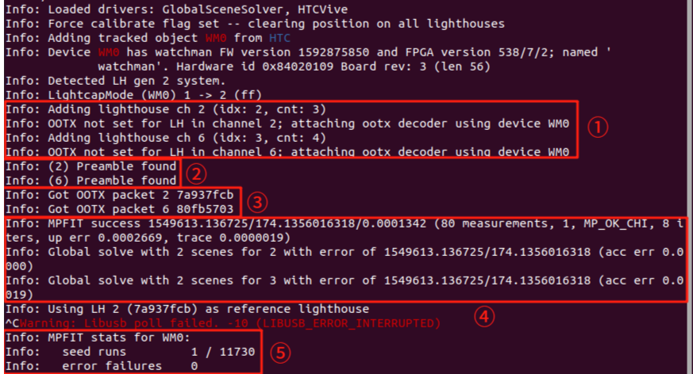

<div align="center">
  <h1 align="center"> pika_ros </h1>
  <h3 align="center"> Agilex Robotics </h3>
  <p align="center">
    <a href="README.md"> English </a> | <a>中文</a> 
  </p>
</div>


## 0. 介绍

Pika 数据套装产品（以下简称Pika）是一款针对**具身智能**领域数据采集场景的**空间数据采集产品**，是一款面向通用操作、轻量化的便携式采执一体化解决方案， 由采集装置及模型推理执行器以及配套的定位基站和数据背包构成。支持高效、准确、快捷、轻量的采集机器人的空间操作数据。

Pika具备超高精度的**毫米级空间信息采集能力**，支持采集数据涵盖六自由度精准空间信息、深度信息、超广角可见光视觉信息以及夹持信息。满足具身智能领域的**数据采集多信息融合需求**。执行器可以基于采集器采集的数据用于模型推理的执行器终端。

该仓库说明了如何使用 pika sense 来采集数据以及如何使用 pika gripper。

## 1. 准备

我们在 Ubuntu 20.04 上测试了我们的代码，其他操作系统可能需要不同的配置。

有关更多信息，您可以参考 [Pika 产品用户手册]() 和 。

### 1.1 软件环境部署准备

1、安装ROS1-noetic，推荐使用fishros按照提示安装

```bash
cd ~ && wget http://fishros.com/install -O fishros && . fishros
```

2、克隆代码

```bash
git clone https://github.com/agilexrobotics/pika_ros.git
```

3、安装依赖

```bash
sudo apt-get update && sudo apt install libjsoncpp-dev ros-noetic-ddynamic-reconfigure libpcap-dev  ros-noetic-serial ros-noetic-ros-numpy python3-pcl libqt5serialport5-dev build-essential zlib1g-dev libx11-dev libusb-1.0-0-dev freeglut3-dev liblapacke-dev libopenblas-dev libatlas-base-dev cmake  git libssl-dev  pkg-config libgtk-3-dev libglfw3-dev libgl1-mesa-dev libglu1-mesa-dev g++  python3-pip  libopenvr-dev
```

```bash
pip3 install opencv-python
```

4、配置USB规则

在pika_ros路径下执行：

```bash
sudo cp scripts/81-vive.rules /etc/udev/rules.d/

sudo udevadm control --reload-rules && sudo udevadm trigger
```

执行完这步后，如电脑上插有无线接收器请将其拔插一遍。

5、安装Realsense-sdk

进入pika_ros/source，将librealsense-2.50.0.zip以及curl-7.75.0.tar.gz解压，修改 librealsense-2.50.0/CMake/external_libcurl.cmake 文件中的  /home/agilex/pika_ros/source/curl-7.75.0 ，将其路径修改成自己 curl-7.75.0 下的路径。

运行：

```bash
cd librealsense-2.50.0 

bash install.bash
```

将source目录下的install.zip压缩包放入~/pika_ros 目录下。

给install目录加执行权限：

```bash
chmod 777 -R install/
```

6、添加环境变量

```BASH
echo 'source ~/pika_ros/install/setup.bash' >> ~/.bashrc
```

pika_ros文件存放架构如下：

```BASH
├── img
├── install
├── README.md
├── scripts
└── source
```

**至此，软件代码配置完毕。**

### 1.2 定位基站校准

使用定位基站对定位标签进行校准的目的是为了获取定位标签在三维空间的绝对坐标值。

定位基站通过发射接收红外光来进行校准。

开始校准前请确保：

> **⚠注意：**
>
>  ● 打开定位标签并将定位标签放置在基站的FOV范围内且保持静止不动。
>
>  ● 确保基站和定位标签的灯都是绿色。
>
>  ● 确保基站的膜撕掉且基站前面无任何遮挡。
>
>  ● 基站位于**不同的频道**。
>
>  ● 确保当前所在房间无太阳照射，基站也会影响到其他红外设备的使用。
>
>  ● 若是第一次部署定位基站，或者定位基站发生了移动，或者定位效果不好，或者切换了频道，都应该进行校准，运行下列指令对定位标签进行校准。
>
>  ● 校准完不会自动关闭程序，应手动（按Ctrl + C）将程序关掉。

校准分以下几种情况，需要根据情况来运行不同的指令：

1、若是在你的电脑上首次进行基站的校准，运行：

```
cd ~/pika_ros/install/lib && ./survive-cli --force-calibrate
```

2、若是新增或减少了基站数量，运行：

```
cd ~/pika_ros/install/lib && ./survive-cli --force-calibrate
```

3、若是进行了频道切换，运行：

```
cd ~/pika_ros/install/lib && ./survive-cli --force-calibrate
```

4、若是定位飘，或者是在使用过程中移动了基站，则运行

```
cd ~/pika_ros/install/lib && ./survive-cli 
```

以下是第一次使用一个sense进行校准成功后终端输出的信息：



①：添加了频道2、6的基站

②：首次校准会出现该字样，说明2、6频道的基站已被找到并添加

③：电脑收到频道2、6基站的数据包

④：显示了定位标签的误差（单位/米），看到终端输出该信息，就可以将校准程序关掉了，这里使用Ctrl+C就能将其关闭

⑤：Ctrl+C 关闭校准程序时会出现的信息，error failures为0代表无丢包，校准成功，如不为0，则需要检查基站的摆放位置以及当前的环境（如太阳光直射）、电脑的USB口是否对校准有影响，排除掉后再次进行校准，直到error failures为0为止。

当按下 Ctrl+C终止程序后出现了报红错误：

```
Warning: Libusb poll failed. -10 (LIBUSB_ERROR_INTERRUPTED)
```

无需理会，不影响后面的定位。

如果使用两个sense进行校准时，终端显示与上面不同的是，会出现：

```
Info: MPFIT stats for WM0:
Info: 	seed runs         1 / 11730
Info: 	error failures    0
Info: MPFIT stats for WM1:
Info: 	seed runs         2 / 10790
Info: 	error failures    0
```

区别就是多了个 WM1，代表目前有2个定位标签进行了校准。

> **⚠**常见校准异常处理
>
> 1.在执行校准指令过程中，无法找到driver_openvr.so文件
>
> 安装依赖： sudo apt install libopenvr-dev   后再次进行校准
>
> 2.校准时终端一直停留不动，并且没有显示定位误差
>
> rm ~/.config/libsurvive/config.json 
>
> 将config.json 文件移除后再次进行校准
>
> 3.校准结束后显示有 error failures
>
> 有 error failures 代表此次校准是失败的，检查当前环境是否有阳光照射或者当下环境是否有主动发射红外光的设备。再次检查基站摆放位置，确保sense在基站的FOV内。当以上事项都检查完毕，再次运行校准程序。
>
> 4.当校准完成，使用一段时间后发现TF坐标飘了
>
> 检查当前环境是否有阳光照射或者当下环境是否有主动发射红外光的设备。再次检查基站摆放位置，确保sense在基站的FOV内。当以上事项都检查完毕，再次运行校准程序。

### 1.3 设置左右手摄像头

> **⚠注意：**
>
> **若使用单夹持器，则无需设置，可以跳过此项，直接进行到数据采集。若使用双夹持器，则需要进行配置。配置后若更换USB端口，则需重新配置。**

当要使用两个 Pika 时，需要设置左右手，否则无法正确记录左右手的数据。

1.获取USB端口

先插入左夹持器USB至工控机（确保工控机只连接一个设备），读取左臂串口连接序列号

```bash
cd /dev && ls | grep ttyUSB
```

结果如图：


之后，运行

```bash
udevadm info /dev/ttyUSB0
```

结果如下：


其中1-6.4:1.0为左加持器USB端口。同理可得到右夹持器USB端口。

2.获取摄像头端口

先插入左夹持器USB至工控机（确保工控机只连接一个设备），读取左臂鱼眼摄像头端口

```bash
cd ~/pika_ros/scripts/

python3 scripts/find_usb_camera.py
```

在摄像头窗口处按下‘q’按键直至显示鱼眼摄像头画面，如下图所示，此时鱼眼摄像头为/dev/video6。


之后，运行

```bash
udevadm info /dev/video6
```

结果如下：


其中1-6.3:1.0为左夹持器鱼眼摄像头端口。同理可得到右夹持器鱼眼摄像头端口。

3.获取深度摄像头序列号

先插入左夹持器USB至工控机（确保工控机只连接一个设备），运行

```bash
rs-enumerate-devices
```

结果如下：


其中230322272619为左夹持器深度摄像头序列号。同理可得到右夹持器深度摄像头序列号。

最终，运行

```bash
gedit ~/pika_ros/scripts/setup.bash
```

结果如下：


按要求填入端口号后保存。

之后，运行

```bash
bash ~/pika_ros/scripts/setup.bash

gedit ~/pika_ros/scripts/start_multi_sensor.bash
```

结果如下：


其中l_depth_camera_no填入左夹持器深度摄像头序列号，r_depth_camera_no填入左夹持器深度摄像头序列号。按要求填入后保存。

### 1.4 设置左右手定位器

1、首先完成定位基站的校准。

2、然后，运行程序获取左右定位标签的序列号，使用序列号来区分左右手。

```bash
roslaunch pika_locator get_code.launch
```

3、一切顺利的话，会在 rviz 中看到除了基座标系（base_link）外，还有两个坐标系。


此时移动 pika，并记录下你想设置左右手的坐标系名称，例如：LHR-EB902458 设置为左手，LHR-FE98B2BE 设置为右手。

4、随后将下面代码填入 .bashrc 文件中：

```bash
echo 'export pika_L_code=LHR-EB902458' >> ~/.bashrc

echo 'export pika_R_code=LHR-FE98B2BE' >> ~/.bashrc

source ~/.bashrc
```

如果 .bashrc 文件已经存在 pika_L_code、pika_R_code，只需将值修改即可。

5、运行设置好左右手程序，打开rviz，手持左右sense运动查看绑定是否正确

```bash
roslaunch pika_locator pika_double_locator.launch 
```

6、运行到此就可以开始采集左右手的数据了。

**至此，完成了软件的所有准备工作，可以开始进行数据采集。**


### 1.5摄像头参数配置（可选）

我们默认给定的的摄像头分辨率为 640x480，帧率为 30 FPS。

如果这不满足您的需求，可按照下面步骤修改摄像头配置参数。

我们提供了俩种分辨率供选择：

|  分辨率  |   帧率   |
| :------: | :------: |
| 640x480  | 30/60/90 |
| 1280x720 |    30    |

运行：

```bash
gedit ~/pika_ros/scripts/start_multi_sensor.bash
```

结果如下：


在红框的参数中选择适合您的参数填入即可，camera_fps 为相机帧率，camera_width 为图像宽度，camera_height 为图像高度。

> **注意：**
>
> **Pika Sense 以及 Pika Gripper 的参数配置一致。参考上述说明即可。**

## 2. 数据采集

### 2.1启动软件

确保基站已经上电以及传感器设备已经接入工控机，启动命令。

若您使用conda虚拟环境，请先退出虚拟环境

```bash
conda deactivate
```

开启鱼眼摄像头、夹爪编码器以及pikaDepthCamera

```bash
cd ~/pika_ros/scripts/

bash start_sensor.bash  # 单夹持器

bash start_multi_sensor.bash  # 双夹持器
```

启动代码后，rviz界面中显示 pika 的tf坐标:


> **⚠注意：**
>
> **在rviz中确保pika的tf变换不抖动不异常。**
>
> **如在无遮挡的情况下仍然出现明显的抖动，则需要再次进行定位校准。**

### 2.2 数据采集

软件启动完成后，运行以下命令进行数据采集。其中datasetDir参数为数据目录；

episodeIndex参数为数据组别，通常采用每组数据递增方式，设置为0即为第0组。

```bash
source ~/pika_ros/install/setup.sh 
roslaunch data_tools run_data_capture.launch datasetDir:=$HOME/agilex/data episodeIndex:=0  # 单夹持器

roslaunch data_tools run_multi_data_capture.launch datasetDir:=$HOME/agilex/data episodeIndex:=0  # 双夹持器
datasetDir:=$HOME/agilex/data/episode0
```

若采集程序成功开启，终端显示如下:

```bash
path: /home/agilex/data/episode0
 total time: 7.0014 
topic: frame in 1 second / total frame 
/camera/color/image_raw: 0 / 165 
/camera_fisheye/color/image_raw: 0 / 0 
/camera/depth/image_rect_raw: 0 / 165 
/camera/depth/color/points: 0 / 165 
/vive_pose: 0 / 0 
/gripper/data: 0 / 367 
/imu/data: 0 / 367 
sum total frame: 1229 
```

请在采集过程中确保每个话题的“frame in 1 second”符合传感器数据频率。

按下Enter按钮结束采集，显示如下为采集结束。

```bash
Done 
[data_tools_dataCapture-1] process has finished cleanly 
log file: /home/noetic/.ros/log/21114750-1995-11ef-b6f1-578b5ce9ba2e/data_tools_dataCapture-1*.log 
all processes on machine have died, roslaunch will exit 
shutting down processing monitor... 
... shutting down processing monitor complete 
done
```

数据示例：

保存数据目录：

|                           **地址**                           | **数据类型** |                           **说明**                           |
| :----------------------------------------------------------: | :----------: | :----------------------------------------------------------: |
|   /home/agilex/data/episode0/camera/color/pikaDepthCamera    |     .png     |               pikaDepthCamera摄像头RGB数据路径               |
|       /home/agilex/data/episode0/camera/color/fisheye        |     .png     |                    鱼眼摄像头RGB数据路径                     |
|   /home/agilex/data/episode0/camera/depth/pikaDepthCamera    |     .png     |              pikaDepthCamera摄像头深度数据路径               |
| /home/agilex/data/episode0/camera/pointCloud/pikaDepthCamera |     .pcd     |              pikaDepthCamera摄像头点云数据路径               |
|   /home/agilex/data/episode0/localization/pose/pikaLocator   |    .json     |       定位器定位数据（位姿x、y、z、roll、pitch、yaw）        |
|       /home/agilex/data/episode0/gripper/encoder/pika        |    .json     |       夹爪开合数据（电机角度angle、夹爪距离distance）        |
|          /home/agilex/data/episode0/imu/9axis/pika           |    .json     | Imu9轴信息（角速度angular_velocity.x\y\z线加速度linear_acceleration.x\y\z        旋转四元数orientation.x\y\z\w） |

以pikaDepthCamera的RGB数据为例子，以时间戳作为文件名称，其结构如下：


> **⚠数据采集过程中常见异常处理**
>
> ● Q：采集的数据帧率异常？
>
> ● A :  请优先检查线束连接稳定性，重新线束插拔后检查数据帧率。

## 3. 数据处理

### 3.1 数据同步

运行以下命令进行数据同步。其中datasetDir参数为数据目录；episodeIndex参数为需要同步数据的组别，若为-1则同步datasetDir目录下的所有数据组。

```bash
source ~/pika_ros/install/setup.sh 

roslaunch data_tools run_data_sync.launch datasetDir:=/home/agilex/data/ episodeIndex:=-1  # 单夹持器

roslaunch data_tools run_multi_data_sync.launch datasetDir:=/home/agilex/data/ episodeIndex:=-1  # 双夹持器
```

同步完成之后，将在每个特定数据路径中生成一个sync.txt文件。例如，图像数据同步索引文件路径：/home/agilex/data/episode0/camera/color/pikaDepthCamera/sync.txt。

sync.txt文件说明：

以pikaDepthCamera的RGB数据为例子，其sync.txt文件如下所示。其中包含了文件名，各个传感器同步后的sync.txt行数一致，为同步后的结果。


### 3.2 数据转换

1、数据转换HDF5

运行以下命令在每个episode路径下生成data.hdf5文件。其中datasetDir参数为数据目录。

若使用点云，先进行点云转换：

```bash
cd ~/pika_ros/scripts

python3 camera_point_cloud_filter.py --datasetDir $HOME/agilex/data/  # 单夹持器

python3 multi_camera_point_cloud_filter.py --datasetDir $HOME/agilex/data/  # 双夹持器
```

之后，转换HDF5：

```bash
cd ~/pika_ros/scripts

python3 data_to_hdf5.py --datasetDir $HOME/agilex/data/  # 单夹持器

python3 multi_data_to_hdf5.py --datasetDir $HOME/agilex/data/  # 双夹持器
```

若不使用点云，直接转换HDF5：

```bash
cd ~/pika_ros/scripts

python3 data_to_hdf5.py --datasetDir $HOME/agilex/data/ --useCameraPointCloud ""  # 单夹持器

python3 multi_data_to_hdf5.py --datasetDir $HOME/agilex/data/ --useCameraPointCloud ""  # 双夹持器
```

data.hdf5文件包含同步的图像路径索引、位姿数据等。

文件说明：

|             **字段**              | **类型** | **维度** |              **说明**               |
| :-------------------------------: | :------: | :------: | :---------------------------------: |
|   camera/color/pikaDepthCamera    |  String  |   (n,)   |  pikaDepthCamera摄像头RGB数据路径   |
|       camera/color/fisheye        |  String  |   (n,)   |        鱼眼摄像头RGB数据路径        |
|   camera/depth/pikaDepthCamera    |  String  |   (n,)   |  pikaDepthCamera摄像头深度数据路径  |
| camera/pointCloud/pikaDepthCamera |  String  |   (n,)   |  pikaDepthCamera摄像头点云数据路径  |
|   localization/pose/pikaLocator   |  Float   |  (n,6)   | 定位器定位数据x\y\z\roll\pitch\yaw  |
|     gripper/encoderAngle/pika     |  Float   |   (n,)   |        夹爪开合距离distance         |
|   gripper/encoderDistance/pika    |  Float   |   (n,)   |        夹爪开合电机角度angle        |
|   imu/9axisAngularVelocity/pika   |  Float   |  (n,3)   | Imu9轴角速度angular_velocity.x\y\z  |
|     imu/9axisOrientation/pika     |  Float   |  (n,4)   | Imu9轴旋转四元数orientation.x\y\z\w |
| imu/9axisLinearAcceleration/pika  |  Float   |  (n,3)   |         Imu9轴线加速度x\y\z         |
|               size                |   Int    |   (n,)   |           数据的采集步长            |

### 3.3 数据重播

请确保数据已经完成同步。

运行以下命令以读取sync.txt的方式进行数据重播。其中datasetDir参数为数据目录；episodeIndex参数为需要重播的数据组别。

```bash
source ~/pika_ros/install/setup.sh

roslaunch data_tools run_data_publish.launch datasetDir:=/home/agilex/data/ episodeIndex:=0  # 单夹持器

roslaunch data_tools run_multi_data_publish.launch datasetDir:=/home/agilex/data/ episodeIndex:=0  # 双夹持器
```

若数据已经生成HDF5，也可采用以下命令以读取HDF5的方式进行数据重播。其中datasetDir参数为数据目录；episodeIndex参数为需要重播的数据组别。

```bash
roscore

cd ~/pika_ros/scripts

python3 data_publish.py --datasetDir $HOME/agilex/data/ --episodeIndex 0  # 单夹持器

python3 multi_data_publish.py --datasetDir $HOME/agilex/data/ --episodeIndex 0  # 双夹持器
```

重播的数据将以话题的形式重新发布，可以通过订阅话题进行查看。

### 3.4 数据加载

在训练过程中加载数据

提供一个加载数据的示例，可以参照~/pika_ros/scripts/load_data_example.py文件进行修改，运行以下命令测试加载数据。其中datasetDir参数为数据目录。

```bash
cd ~/pika_ros/scripts

python3 load_data_example.py --datasetDir /home/agilex/data/
```

## 4. pika gripper的使用

行器USB设置，修改文件gedit ~/pika_ros/scripts/setup.bash 以及

gedit ~/pika_ros/scripts/start_multi_gripper.bash。

之后，开启鱼眼摄像头、pikaDepthCamera和电机控制串口：

```bash
cd ~/pika_ros/scripts/

bash start_gripper.bash  # single gripper

bash start_multi_gripper.bash  # double gripper
```

控制电机：

1、失能：发布话题/gripper/ctrl消息如下：


双执行器情况下，左执行器话题为/gripper_l/ctrl，右执行器话题为/gripper_r/ctrl。

2、使能：发布话题/gripper/ctrl如下：


双执行器情况下，左执行器话题为/gripper_l/ctrl，右执行器话题为/gripper_r/ctrl。

3、控制电机角度：发布话题/gripper/ctrl消息如下：


双执行器情况下，左执行器话题为/gripper_l/ctrl，右执行器话题为/gripper_r/ctrl。

或者发布话题/joint_states消息如下：


双执行器情况下，左执行器话题为/joint_states_l，右执行器话题为/joint_states_r。

4、设置零点：请先使能之后，将夹爪闭合，再设置零点。发布话题/gripper/ctrl消息如下：


双执行器情况下，左执行器话题为/gripper_l/ctrl，右执行器话题为/gripper_r/ctrl。

订阅电机信息：

```bash
rostopic echo /gripper/data  # single gripper
rostopic echo /gripper_l/data  # double gripper, left
rostopic echo /gripper_r/data  # double gripper, right
```

输出数据如下：


或者：

```bash
rostopic echo /gripper/joint_states  # single gripper
rostopic echo /gripper_l/joint_states  # double gripper, left
rostopic echo /gripper_r/joint_states  # double gripper, right
```

输出数据如下：


## 5. 遥操作

>注意：
>
>- 本仓库遥操的 Piper 机械臂的末端夹爪是默认夹爪，如下图所示。
>- 遥操的Xarm机械臂型号是lite6，如需要适配到其他款的xarm或者其他厂商的机械臂需要根据情况修改机械臂的控制接口以及坐标系转换。
>- 开启和关闭的操作是通过串口通信方式传输 trigger 信号，务必要连接线且不能跳过触发trigger这一阶段，否则机械臂会出现失控的情况。


### 5.1 准备

1、克隆代码下本地并将其放置到 pika_ros/src 下

```bash
cd ~/pika_ros/src

git clone https://github.com/agilexrobotics/PikaAnyArm.git
```

2、编译代码

```bash
cd ~/pika_ros

catkin_make install -DCATKIN_WHITELIST_PACKAGES=""
```

3、安装环境依赖

```bash
conda create -n pika python=3.8.18

conda activate pika

conda install pinocchio casadi -c conda-forge

pip install meshcat rospkg pyyaml
```

我们仅在 Ubuntu 20.04 上测试了我们的代码，其他操作系统可能需要不同的配置。

在运行程序时如遇到：

```bash
ImportError: /lib/x86_64-linux-gnu/libstdc++.so.6: version `GLIBCXX_3.4.29' not found (required by /home/agilex/miniconda3/envs/pika/lib/python3.8/site-packages/pinocchio/pinocchio_pywrap_default.cpython-38-x86_64-linux-gnu.so)
```

则在终端输入：

```bash
export LD_PRELOAD=/home/agilex/miniconda3/envs/pika/lib/libstdc++.so.6 
```

再次执行代码即可。

### 5.2 开始

#### 5.2.1 单臂遥操Piper

1、机械臂使能

将机械臂的can线接入电脑

然后执行：

```bash
cd ~/pika_ros/src/piper_ros

bash can_activate.sh can0 1000000
```

2、对pika进行校准，详细步骤可参考 Pika 产品用户手册的 【2.1 基站部署】和【2.5 定位基站校准】

3、开启遥操单Piper程序

```bash
source ~/pika_ros/install/setup.bash

roslaunch remote_operation teleop_single_piper.launch
```

4、开启程序后，Piper机械臂会去到设定的位姿，如想开启遥操作，则需要将夹爪快速往中心开合关闭两下触发trigger。关闭遥操同理。

#### 5.2.2 双臂遥操Piper

1、机械臂使能

先将左机械臂的can线接入电脑

然后执行：

```bash
cd ~/pika_ros/src/piper_ros

bash find_all_can_port.sh 
```

终端会出现左机械臂的端口号，接着将右机械臂的can线接入电脑

再次执行：

```bash
bash find_all_can_port.sh 
```

终端会出现左机械臂的端口号。

将这左右两个端口号复制到 can_config.sh 文件的 111 和 112 行，如下所示：

```bash
# 预定义的 USB 端口、目标接口名称及其比特率（在多个 CAN 模块时使用）
if [ "$EXPECTED_CAN_COUNT" -ne 1 ]; then
    declare -A USB_PORTS 
    USB_PORTS["1-8.1:1.0"]="left_piper:1000000"  #左机械臂
    USB_PORTS["1-8.2:1.0"]="right_piper:1000000" #右机械臂
fi
```

保存完毕后，激活左右机械臂使能脚本：

```bash
cd ~/pika_ros/src/piper_ros

bash can_config.sh 
```

2、对pika进行校准，详细步骤可参考 <<Pika 产品用户手册>> 的 【2.1 基站部署】、【2.5 定位基站校准】、【2.6 设置左右手摄像头】、【2.7 设置左右手定位器】，在【2.6 设置左右手摄像头】这步中主要设置的是左右夹持器端口号，左右鱼眼相机端口号不用设置。

3、开启遥操双Piper程序

```bash
source ~/pika_ros/install/setup.bash

roslaunch remote_operation teleop_double_piper.launch
```

4、开启程序后，Piper机械臂会去到设定的位姿，如想开启遥操作，则需要将夹爪快速往中心开合关闭两下触发trigger。关闭遥操同理。

#### 5.2.3 遥操单臂Xarm lite6

配置xarm机械臂:

1、将机械臂网口接入电脑后，对网口进行配置：

我们使用的是 lite6 这款机械臂，它默认的 IP 为：192.168.1.163

不同的机械臂可能配置会有所不同，下面是lite6的网口配置


配置好后，打开 xarm 的 web 端：

http://192.168.1.163:18333/?lang=cn&channel=prod

2、在设置里面找到高级设置里面的辅助功能，确保姿态控制方式为 R/P/Y 方式。


3、开启遥操单 Xarm 程序

```bash
roslaunch remote_operation teleop_single_xarm.launch
```

4、开启程序后，lite6机械臂会去到设定的位姿，如想开启遥操作，则需要将夹爪快速往中心开合关闭两下触发trigger。关闭遥操同理。

### 5.3 配置文件说明

在 config 文件夹中：

1、piper_params.yaml 中的：

- gripper_xyzrpy 指的是夹爪相对于机器人joint6的偏移量，单位是米和弧度。
- target_joint_state 指的是机械臂初始位姿的6个关节角度，单位为弧度。

2、xarm_params.yaml 中的：

- eff_position 指的是机械臂的执行器初始位置和方向，单位是毫米和弧度。
- pika_to_arm 指的是从pika夹爪中心坐标系到机械臂末端执行器坐标系的转换，单位是米和弧度。

### 5.4遥操你的机械臂

为了方便用户使用 pika sense 遥操自己的机械臂，我们在此说明：

- pika 夹爪末端坐标系
- pika_pose 话题信息

#### 5.4.1 pika坐标系图


pika的坐标系是在夹爪中心上，通过 pika_pose 话题发布。

pika_pose 话题的坐标系如上图所示：x轴超前、y轴朝左、z轴朝右。

#### 5.4.2话题信息

单个 pika sense 遥操下发控制机械臂的话题名为：/pika_pose，左右手 pika sense遥操下发话题分别对应：/pika_pose_l、/pika_pose_r。

/pika_pose 话题的数据类型为 geometry_msgs::PoseStamped，市场主流机械臂一般都会开放机械臂末端控制接口，其消息类型也是 geometry_msgs::PoseStamped

代码可以参考：teleop_xarm.py

