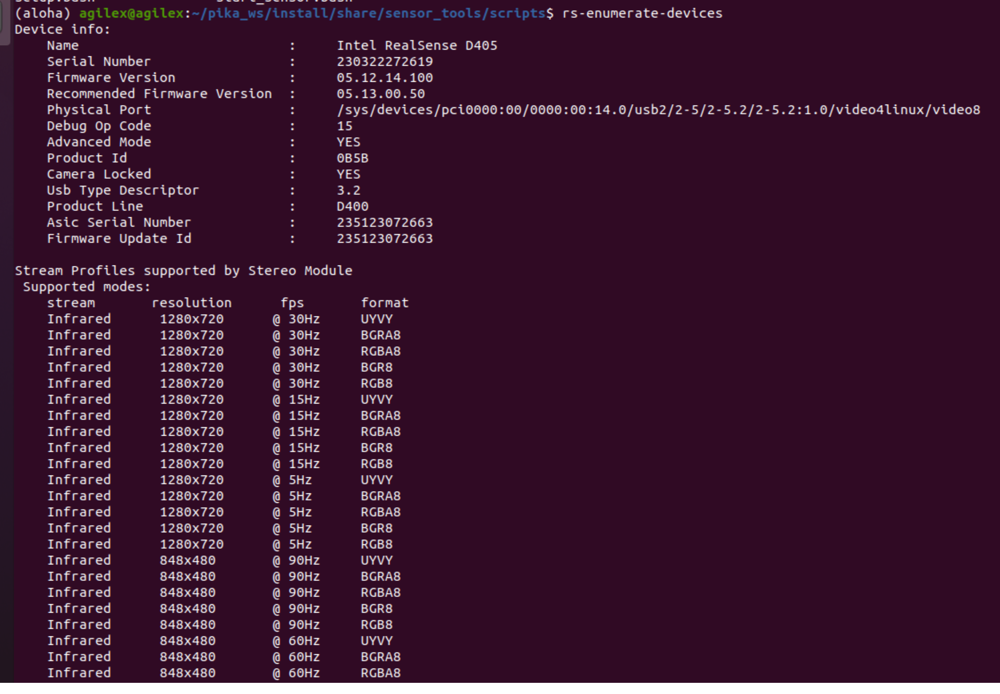

<div align="center">
  <h1 align="center"> pika_ros </h1>
  <h3 align="center"> Agilex Robotics </h3>
  <p align="center">
    <a href="README.md"> English </a> | <a>中文</a> 
  </p>
</div>


## 0.介绍

Pika 数据套装产品（以下简称Pika）是一款针对**具身智能**领域数据采集场景的**空间数据采集产品**，是一款面向通用操作、轻量化的便携式采执一体化解决方案， 由采集装置及模型推理执行器以及配套的定位基站和数据背包构成。支持高效、准确、快捷、轻量的采集机器人的空间操作数据。

Pika具备超高精度的**毫米级空间信息采集能力**，支持采集数据涵盖六自由度精准空间信息、深度信息、超广角可见光视觉信息以及夹持信息。满足具身智能领域的**数据采集多信息融合需求**。执行器可以基于采集器采集的数据用于模型推理的执行器终端。

该仓库说明了如何使用 pika sense 来采集数据以及如何使用 pika gripper。

## 1. 准备

我们在 Ubuntu 20.04 上测试了我们的代码，其他操作系统可能需要不同的配置。

有关更多信息，您可以参考 [Pika 产品用户手册]() 和 。

### 1.1 软件环境部署准备

1、安装ROS1-noetic
推荐使用fishros按照提示安装

```bash
cd ~ && wget http://fishros.com/install -O fishros && . fishros
```

2、克隆代码

```bash
git clone git@github.com:agilexrobotics/pika_ros.git
```

3、安装依赖

```bash
sudo apt-get update && sudo apt install libjsoncpp-dev ros-noetic-ddynamic-reconfigure libpcap-dev  ros-noetic-serial ros-noetic-ros-numpy python3-pcl libqt5serialport5  build-essential zlib1g-dev libx11-dev libusb-1.0-0-dev freeglut3-dev liblapacke-dev libopenblas-dev libatlas-base-dev cmake  git libssl-dev libusb-1.0-0-dev pkg-config libgtk-3-dev libglfw3-dev libgl1-mesa-dev libglu1-mesa-dev 
```

4、配置USB规则
在pika_ros路径下执行：

```bash
sudo cp scripts/81-vive.rules /etc/udev/rules.d/

sudo udevadm control --reload-rules && sudo udevadm trigger
```

5、安装Realsense-sdk
该步骤需要科学上网，请自行配置。
进入pika_ros/source，将librealsense-2.50.0.zip解压，运行

```bash
cd librealsense-2.50.0 

bash install.bash
```

将source目录下的install.zip压缩包放入~/pika_ros 目录下。
给install目录加执行权限：

```bash
chmod 777 -R install/
```

6、添加环境变量

```bash
echo 'source ~/pika_ros/install/setup.bash' >> ~/.bashrc
```

pika_ros文件存放架构如下：

```bash
├── img
├── install
├── README.md
├── scripts
└── source
```

至此，软件代码配置完毕。

### 1.2 定位基站校准

若是第一次部署定位基站，或者定位基站发生了移动，或者定位效果不好，或者切换了频道，都应该进行校准，运行下列指令对定位标签进行校准:

```bash
cd ~/pika_ros/scripts/

./calibration.bash
```

启动校准程序后，确保追踪器在两个定位基站的定位范围内，正常的校准过程需要花 10 s 左右，看到终端显示下面信息时：

```bash
Info: MPFIT success 283446.053347/90.8577511297/0.0000793 (81 measurements, 1, MP_OK_CHI, 5 iters, up err 0.0002793, trace 0.0000035)
Info: Global solve with 2 scenes for 0 with error of 283446.053347/90.8577511297 (acc err 0.0013)
Info: Global solve with 2 scenes for 3 with error of 283446.053347/90.8577511297 (acc err 0.0007)
Info: Using LH 3 (80fb5703) as reference lighthouse
Info: MPFIT success 145.370101/114.4120840723/0.0000773 (121 measurements, 1, MP_OK_CHI, 34 iters, up err 0.0001909, trace 0.0000071)
Info: Global solve with 3 scenes for 0 with error of 145.370101/114.4120840723 (acc err 0.0015)
Info: Global solve with 3 scenes for 3 with error of 145.370101/114.4120840723 (acc err 0.0007)
Info: Using LH 3 (80fb5703) as reference lighthouse
```

按下 Ctrl+C 关闭校准程序，当看到终端显示 seed runs 有发送数据且 error failures 的数量为 0 时，就代表校准完成。如下图所示：


注意：

校准完不会自动关闭程序，应手动（按Ctrl + C）将程序关掉，方可进入到下一步。

### 1.3 设置左右手摄像头

绑定设备（双夹持器配置，单夹持器不用。配置后若更换USB端口，则需重新配置）

当要使用两个 pika 时，需要设置左右手，否则无法正确记录左右手的数据。

1.获取USB端口

先插入左夹持器USB至工控机（确保工控机只连接一个设备），读取左臂串口连接序列号

```bash
cd /dev && ls | grep ttyUSB
```

结果如图：


之后，运行

```bash
udevadm info /dev/ttyUSB0
```

结果如下：


其中1-6.4:1.0为左加持器USB端口。同理可得到右夹持器USB端口。

2.获取摄像头端口

先插入左夹持器USB至工控机（确保工控机只连接一个设备），读取左臂鱼眼摄像头端口

```bash
cd ~/pika_ros/scripts

source install/setup.bash

python install/share/sensor_tools/scripts/find_usb_camera.py
```

在摄像头窗口处按下‘q’按键直至显示鱼眼摄像头画面，如下图所示，此时鱼眼摄像头为/dev/video6。


之后，运行

```bash
udevadm info /dev/video6
```

结果如下：


其中1-6.3:1.0为左夹持器鱼眼摄像头端口。同理可得到右夹持器鱼眼摄像头端口。

3.获取深度摄像头序列号

先插入左夹持器USB至工控机（确保工控机只连接一个设备），运行

```bash
rs-enumerate-devices
```

结果如下：



其中230322272619为左夹持器深度摄像头序列号。同理可得到右夹持器深度摄像头序列号。

最终，运行

```bash
gedit ~/pika_ros/scripts/setup.bash
```

结果如下：


按要求填入端口号后保存。

之后，运行

```bash
bash ~/pika_ros/scripts/setup.bash

gedit ~/pika_ros/scripts/start_multi_sensor.bash
```

结果如下：


其中l_depth_camera_no填入左夹持器深度摄像头序列号，r_depth_camera_no填入左夹持器深度摄像头序列号。按要求填入后保存。

### 1.4 设置左右手定位器

1、首先校准定位器。

2、运行程序

```bash
roslaunch pika_locator get_code.launch
```

3、一切顺利的话，会在 rviz 中看到除了基座标系（base_link）外，还有两个坐标系。


此时移动 pika，并记录下你想设置左右手的坐标系名称，例如：LHR-EB902458 设置为左手，LHR-FE98B2BE 设置为右手。

4、随后将下面代码填入 .bashrc 文件中：

```bash
echo 'export pika_L_code=LHR-EB902458' >> ~/.bashrc

echo 'export pika_R_code=LHR-FE98B2BE' >> ~/.bashrc

source ~/.bashrc
```

如果 .bashrc 文件已经存在 pika_L_code、pika_R_code，只需将值修改即可。

5、运行设置好左右手程序

```bash
roslaunch pika_locator pika_double_tracker.launch 
```

6、运行到此就可以开始采集左右手的数据了。

**至此，完成了软件的所有准备工作，可以开始进行数据采集。**


### 1.5摄像头参数配置（可选）

我们默认给定的的摄像头分辨率为 640x480，帧率为 30 FPS。

如果这不满足您的需求，可按照下面步骤修改摄像头配置参数。

我们提供了俩种分辨率供选择：

|  分辨率  |   帧率   |
| :------: | :------: |
| 640x480  | 30/60/90 |
| 1280x720 |    30    |

运行：

```bash
gedit ~/pika_ros/scripts/start_multi_sensor.bash
```

结果如下：


在红框的参数中选择适合您的参数填入即可，camera_fps 为相机帧率，camera_width 为图像宽度，camera_height 为图像高度。

**注意：**

**Pika Sense 以及 Pika Gripper 的参数配置一致。参考上述说明即可。**


## 2. 数据采集

### 2.1启动软件

确保基站已经上电以及传感器设备已经接入工控机，启动命令。

若您使用conda虚拟环境，请先退出虚拟环境

```bash
conda deactivate
```

开启鱼眼摄像头、夹爪编码器以及pikaDepthCamera

```bash
cd ~/pika_ros/scripts/

bash start_sensor.bash  # 单夹持器

bash start_multi_sensor.bash  # 双夹持器
```

启动代码后，rviz界面中显示 pika 的tf坐标:


在rviz中确保pika的tf变换不抖动不异常。

如在无遮挡的情况下仍然出现明显的抖动，则需要再次进行定位校准。

### 2.2 数据采集

运行以下命令进行数据采集。其中datasetDir参数为数据目录；episodeIndex参数为数据组别，通常采用每组数据递增方式，设置为0即为第0组。

```bash
source ~/pika_ros/install/setup.sh 
roslaunch data_tools run_data_capture.launch datasetDir:=/home/agilex/data episodeIndex:=0  # 单夹持器
roslaunch data_tools run_multi_data_capture.launch datasetDir:=/home/agilex/data episodeIndex:=0  # 双夹持器
datasetDir:=/home/agilex/data/episode0
```

若采集程序成功开启，终端显示如下:

```bash
path: /home/agilex/data/episode0
 total time: 7.0014 
topic: frame in 1 second / total frame 
/camera/color/image_raw: 0 / 165 
/camera_fisheye/color/image_raw: 0 / 0 
/camera/depth/image_rect_raw: 0 / 165 
/camera/depth/color/points: 0 / 165 
/vive_pose: 0 / 0 
/gripper/data: 0 / 367 
/imu/data: 0 / 367 
sum total frame: 1229 
```

请在采集过程中确保每个话题的“frame in 1 second”符合传感器数据频率。

按下Enter按钮结束采集，显示如下为采集结束。

```bash
Done 
[data_tools_dataCapture-1] process has finished cleanly 
log file: /home/noetic/.ros/log/21114750-1995-11ef-b6f1-578b5ce9ba2e/data_tools_dataCapture-1*.log 
all processes on machine have died, roslaunch will exit 
shutting down processing monitor... 
... shutting down processing monitor complete 
done
```

数据示例：

保存数据目录：

|                           **地址**                           | **数据类型** |                           **说明**                           |
| :----------------------------------------------------------: | :----------: | :----------------------------------------------------------: |
|   /home/agilex/data/episode0/camera/color/pikaDepthCamera    |     .png     |               pikaDepthCamera摄像头RGB数据路径               |
|       /home/agilex/data/episode0/camera/color/fisheye        |     .png     |                    鱼眼摄像头RGB数据路径                     |
|   /home/agilex/data/episode0/camera/depth/pikaDepthCamera    |     .png     |              pikaDepthCamera摄像头深度数据路径               |
| /home/agilex/data/episode0/camera/pointCloud/pikaDepthCamera |     .pcd     |              pikaDepthCamera摄像头点云数据路径               |
|   /home/agilex/data/episode0/localization/pose/pikaLocator   |    .json     |       定位器定位数据（位姿x、y、z、roll、pitch、yaw）        |
|       /home/agilex/data/episode0/gripper/encoder/pika        |    .json     |       夹爪开合数据（电机角度angle、夹爪距离distance）        |
|          /home/agilex/data/episode0/imu/9axis/pika           |    .json     | Imu9轴信息（角速度angular_velocity.x\y\z线加速度linear_acceleration.x\y\z        旋转四元数orientation.x\y\z\w） |

以pikaDepthCamera的RGB数据为例子，以时间戳作为文件名称，其结构如下：


## 3. 数据处理

### 3.1 数据同步

运行以下命令进行数据同步。其中datasetDir参数为数据目录；episodeIndex参数为需要同步数据的组别，若为-1则同步datasetDir目录下的所有数据组。

```bash
source ~/pika_ros/install/setup.sh 
roslaunch data_tools run_data_sync.launch datasetDir:=/home/agilex/data/ episodeIndex:=-1  # 单夹持器
roslaunch data_tools run_multi_data_sync.launch datasetDir:=/home/agilex/data/ episodeIndex:=-1  # 双夹持器
```

同步完成之后，将在每个特定数据路径中生成一个sync.txt文件。例如，图像数据同步索引文件路径：/home/agilex/data/episode0/camera/color/pikaDepthCamera/sync.txt。

sync.txt文件说明：

以pikaDepthCamera的RGB数据为例子，其sync.txt文件如下所示。其中包含了文件名，各个传感器同步后的sync.txt行数一致，为同步后的结果。\


### 3.2 数据转换

数据转换HDF5

运行以下命令在每个episode路径下生成data.hdf5文件。其中datasetDir参数为数据目录。

```bash
cd ~/pika_ros/scripts
python3 data_to_hdf5.py --datasetDir /home/agilex/data/  # 单夹持器
python3 multi_data_to_hdf5.py --datasetDir /home/agilex/data/  # 双夹持器
```

data.hdf5文件包含同步的图像路径索引、位姿数据等。

文件说明：

|             **字段**              | **类型** | **维度** |              **说明**               |
| :-------------------------------: | :------: | :------: | :---------------------------------: |
|   camera/color/pikaDepthCamera    |  String  |   (n,)   |  pikaDepthCamera摄像头RGB数据路径   |
|       camera/color/fisheye        |  String  |   (n,)   |        鱼眼摄像头RGB数据路径        |
|   camera/depth/pikaDepthCamera    |  String  |   (n,)   |  pikaDepthCamera摄像头深度数据路径  |
| camera/pointCloud/pikaDepthCamera |  String  |   (n,)   |  pikaDepthCamera摄像头点云数据路径  |
|   localization/pose/pikaLocator   |  Float   |  (n,6)   | 定位器定位数据x\y\z\roll\pitch\yaw  |
|     gripper/encoderAngle/pika     |  Float   |   (n,)   |        夹爪开合距离distance         |
|   gripper/encoderDistance/pika    |  Float   |   (n,)   |        夹爪开合电机角度angle        |
|   imu/9axisAngularVelocity/pika   |  Float   |  (n,3)   | Imu9轴角速度angular_velocity.x\y\z  |
|     imu/9axisOrientation/pika     |  Float   |  (n,4)   | Imu9轴旋转四元数orientation.x\y\z\w |
| imu/9axisLinearAcceleration/pika  |  Float   |  (n,3)   |         Imu9轴线加速度x\y\z         |
|               size                |   Int    |   (n,)   |           数据的采集步长            |

### 3.3 数据重播

请确保数据已经完成同步。

运行以下命令以读取sync.txt的方式进行数据重播。其中datasetDir参数为数据目录；episodeIndex参数为需要重播的数据组别。

```bash
source ~/pika_ros/install/setup.sh
roslaunch data_tools run_data_publish.launch datasetDir:=/home/agilex/data/ episodeIndex:=0  # 单夹持器
roslaunch data_tools run_multi_data_publish.launch datasetDir:=/home/agilex/data/ episodeIndex:=0  # 双夹持器
```

若数据已经生成HDF5，也可采用以下命令以读取HDF5的方式进行数据重播。其中datasetDir参数为数据目录；episodeIndex参数为需要重播的数据组别。

```bash
roscore
cd ~/pika_ros/scripts/
python3 data_publish.py --datasetDir /home/agilex/data/ --episodeIndex 0  # 单夹持器
python3 data_publish.py --datasetDir /home/agilex/data/ --episodeIndex 0  # 双夹持器
```

重播的数据将以话题的形式重新发布，可以通过订阅话题进行查看。

### 3.4 数据加载

在训练过程中加载数据

提供一个加载数据的示例，可以参照~/pika_ros/scripts/load_data_example.py文件进行修改，运行以下命令测试加载数据。其中datasetDir参数为数据目录。

```bash
python load_data_example.py --datasetDir /home/agilex/data/
```

## 4. pika gripper的使用

使用执行器之前，请确保执行器电源已经上电。若使用左右双执行器，请参照设置左右手摄像头进行左右执行器USB设置，修改文件~/pika_ros/scripts/setup.bash 以及 gedit ~/pika_ros/scripts/start_multi_gripper.bash。

之后，开启鱼眼摄像头、pikaDepthCamera和电机控制串口：

```bash
cd ~/pika_ros/scripts/
bash start_gripper.bash  # single gripper
bash start_multi_gripper.bash  # double gripper
```

控制电机：

1、失能：发布话题/gripper/ctrl消息如下：


双执行器情况下，左执行器话题为/gripper_l/ctrl，右执行器话题为/gripper_r/ctrl。

2、使能：发布话题/gripper/ctrl如下：


双执行器情况下，左执行器话题为/gripper_l/ctrl，右执行器话题为/gripper_r/ctrl。

3、控制电机角度：发布话题/gripper/ctrl消息如下：


双执行器情况下，左执行器话题为/gripper_l/ctrl，右执行器话题为/gripper_r/ctrl。

或者发布话题/joint_states消息如下：


双执行器情况下，左执行器话题为/joint_states_l，右执行器话题为/joint_states_r。

4、设置零点：请先使能之后，将夹爪闭合，再设置零点。发布话题/gripper/ctrl消息如下：


双执行器情况下，左执行器话题为/gripper_l/ctrl，右执行器话题为/gripper_r/ctrl。

订阅电机信息：

```bash
rostopic echo /gripper/data  # single gripper
rostopic echo /gripper_l/data  # double gripper, left
rostopic echo /gripper_r/data  # double gripper, right
```

输出数据如下：


或者：

```bash
rostopic echo /gripper/joint_states  # single gripper
rostopic echo /gripper_l/joint_states  # double gripper, left
rostopic echo /gripper_r/joint_states  # double gripper, right
```

输出数据如下：


